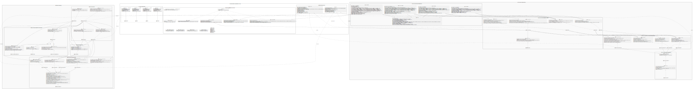

# ChatSystem Architecture Overview

This document outlines the high-level architecture of the entire ChatSystem application.

The system is split into **3** core pillars:

- The **Client** (Frontend, GUI, and local cache)
- The **Core** (Shared Domain Models, Validation Engine, & REST API Contracts)
- The **Server** (Stateless, Zero-Knowledge backend)



## 1. Architectural Reasoning & Third-Party Stack

The choice of external dependencies is driven strictly by architectural goals: compile-time performance, memory safety and platform portability.

The entire stack is orchestrated via CMake, and Clang tools.

| Dependency | Component Layer | Architectural Reasoning |
|---|---|---|
| OpenSSL | Client / Server Crypto | Provides cryptographic primitives (scrypt, AES-256, RSA), memory-hard password stretching and hardware-accelerated symmetric streaming. |
| Boost (Asio/Beast) | Client / Server Networking | Provides a low-level, high-performance asynchronous execution context. Beast translates raw sockets into HTTP and WebSocket state machines. |
| SQLite3 | Client Database | Single-file, embedded transactional storage engine. Enables fast local lookups on the UI thread without server roundtrips. |
| libpqxx | Server Database | Mature C++ client library for PostgreSQL. Provides type-safe query execution, RAII-based transaction management, and modern C++ abstractions for database interactions. |
| nlohmann/json | Core Data Interchange | Modern C++ JSON parsing using native STL container APIs. Simplifies object serialization. |
| wxWidgets | Client GUI | Cross-platform, native-UI framework. Applications are significantly lighter in RAM, binary size, and startup overhead. |

---

## 2. The Core Architecture (Shared Static Library)

The Core component is a standalone, dependency-free static library linked by both the Client and Server.

It serves as the absolute source of truth for communication schemas and business boundaries.

### Concrete API Contract Mapping

Eliminates network mismatches by centralizing HTTP routes, path parameters, and payload keys into immutable constexpr schema definitions.

### Authentication Contracts (`auth_contract.h`)

- `POST /auth/register` → Payload: { login, password, public_key }
- `POST /auth/login` → Payload: { login, password } → Yields user identity and a session token.
- `POST /auth/logout` → Invalidates the active tracking token.


### Chat Management Contracts (`chat_contract.h`)

- `POST /chats` / `GET /chats` → Create room or fetch active collections.
- `GET /chats/{id}` / `DELETE /chats/{id}` → Target specific rooms using path parameter tokens.
- `GET /chats/{id}/participants` → Manipulate group compositions.


### Messaging & E2EE Key Routing Contracts (`message_contract.h`)

- `POST /chats/{id}/messages` → Transmits E2EE package: { ciphertext, encrypted_keys, type }.
- `GET /messages/{id}/key` → Queries for the caller's specific asymmetric-wrapped AES session key.
- `GET /messages/undelivered` → Bulk pulls unread messages.


### User Profiling and Search Contracts (`user_contract.h`)

- `GET /users/search?q={query}` → Queries global directory using search criteria.
- `GET /users/{id}/public-key` → Fetches participant public key before executing local asymmetric wrapping.


### Type Safety, Domain Entities, & Metaprogramming

The application minimizes pointer overhead and heap fragmentation by prioritizing value semantics and modern C++ type safety:

- **Strongly Typed Identifiers** (`BaseId<T>`): 
Wraps raw primitives into distinct types (`UserId`, `ChatId`, `MessageId`). This prevents passing a `ChatId` into a parameter expecting a `UserId` at compile time.

- **Variant Pattern Matching:**
Domain types leverage `std::variant` (e.g., `MessageTypeVariant` for text/system variants) instead of classical polymorphic inheritance, keeping objects contiguous in memory and eliminates vtable lookup.

- **The overload Idiom:**
By combining **std::visit** with a custom variadic template structuring pattern:

```cpp
template<class... Ts> struct overload : Ts... { using Ts::operator()...; };
template<class... Ts> overload(Ts...) -> overload<Ts...>;
```

We achieve strict, compiler-enforced pattern matching across application variants, making missing handler bugs impossible to compile.

---

### The Validation Engine

A declarative validation framework evaluates business invariants on both sides of the network using IValidator, RuleBase, and AndRule.

**Execution:**

- Rules (e.g., password complexity, size limits) are written exactly once in Core.
- The Client runs these rules to fail early and keep the UI responsive.
- The Server executes them to drop malformed data before allocating expensive database resources.


## 3. The Client Architecture

The Client relies on a strictly decoupled, vertically layered architecture.

The primary motivation of this design is to separate raw SQL execution, domain business logic, and network synchronization into highly cohesive, single-responsibility components.


### Client Layer Diagram

```
+--------------------------------------------------------+
|                Client Application Entry                |
+--------------------------------------------------------+
                           |  (Invokes business operations)
                           v
+--------------------------------------------------------+
|  Services (Orchestration, Cryptography, Business Rules)|
+--------------------------------------------------------+
           | (Syncs remote data)               | (Persists local state)
           v                                   v
+--------------------+       +-----------------------------------+
|  BoostRestClient   |       |    Repositories (Domain CRUD)     |
+--------------------+       +-----------------------------------+
                                               | (Executes SQL)
                                               v
                             +-----------------------------------+
                             |     SQLite3 Database (Cache)      |
                             +-----------------------------------+
```

---

## Layer 1: The Services (Orchestration & Business Logic)

Services act as the "brains" of the application.

They contain zero SQL and zero direct HTTP formatting, but orchestrate the full flow of data between networking, cryptography, and persistence.

### Components
- `IClientMessageService`
- `IClientAuthService`
- `IClientChatService`
- `IClientUserService`

### Primary Role
Enforce business rules and coordinate multiple dependencies to complete a single user action.

### Execution Flow Example (`ClientMessageService::SendMessage`)

- Validates the user's active session state
- Queries `IClientChatService` for public keys of chat participants
- Uses `IClientEncryptionService` to generate AES session key and encrypt plaintext
- Wraps AES key asymmetrically for each participant
- Sends encrypted payload via `IRestClient`
- Maps server response into a Domain entity
- Persists result via `ILocalMessageRepository`

## Layer 2: The Repositories (Data Abstraction & Translation)

Repositories form the bridge between C++ domain objects and relational storage.

They implement the **Data Mapper / Repository Pattern**.

### Components
- `ILocalMessageRepository`
- `ILocalIdentityRepository`
- `ILocalUserRepository`
- `ILocalChatRepository`

### Primary Role
Hide all database-specific logic (SQL queries, bindings, row iteration) from Services.

### Architectural Reasoning

- **Type Safety**
  - Uses strongly typed domain objects (e.g., CachedMessage, CachedIdentity)
  - Prevents SQL injection via prepared statements

- **Domain Translation**
  - Converts SQLite rows into fully instantiated C++ domain objects
  - Services never deal with raw SQL results

- **Separation of Concerns**
  - Switching SQLite → another storage (LevelDB, JSON, etc.) only affects repositories
  - Services remain unchanged

 ### Execution Flow Example (`ILocalMessageRepository::FindByChatId`)

- The `ClientMessageService` requests chat history by calling:
  - `FindByChatId(chat_id, limit, offset)`

- The concrete `Sqlite3MessageRepository` prepares a compiled SQL `SELECT` statement.

- The repository safely binds C++ variables:
  - `chat_id`, `limit`, `offset`
  - These are bound directly to SQL parameters
  - This fully prevents SQL injection attacks

- The repository executes the query against `Sqlite3LocalDatabase` and iterates through returned tabular rows

- **Mapping Phase:**
  - Each row’s primitive columns (strings, integers, timestamps) are extracted and used to construct a fully instantiated C++ domain object:
    - `CachedMessage`

- A `std::vector<CachedMessage>` is returned to the service
  - The service remains completely unaware that SQLite was used
  - The storage backend can be replaced without modifying business logic.


## Layer 3: The Local Database (Vault & Cache)

The foundation of the client is the embedded storage engine, acting as the single source of truth.

### Components
- `ILocalDatabase`
- `Sqlite3LocalDatabase`

### Primary Role
Persistent offline storage for:
- User sessions
- Chat history
- Locally wrapped cryptographic keys

### Architectural Reasoning

- **Cache-Aside Model**
  - App loads instantly from local database
  - Server syncs only incremental updates via `/messages/undelivered`

- **Offline-first behavior**
  - UI remains fully functional without network access
  - Background sync updates state gradually

- **RAII Resource Management**
  - SQLite connections and prepared statements are safely released
  - Prevents memory leaks and database corruption on shutdown


## Cryptography & The Zero-Knowledge Pipeline

The Client retains absolute ownership of all cryptographic keys.

The server acts strictly as a transport layer:
- It stores and forwards encrypted bytes
- It mathematically cannot decrypt the payload

To achieve this safely without leaking :contentReference[oaicite:0]{index=0} dependencies into the business logic, the cryptographic subsystem is divided into four specialized pillars.

---

## The Cryptographic Pillars

### `IKeyDerivationService` (Key Protection)

Uses memory-hard algorithms (`scrypt` via OpenSSL) to stretch the user's plaintext password into a Master Encryption Key (MEK).

#### Responsibilities
- Derives secure encryption material from user credentials
- Protects against brute-force attacks
- Secures the local cryptographic vault

### `IKeyStore` (The Vault)

Persistent local storage for the user's asymmetric keypair.

#### Responsibilities
- Stores encrypted private keys locally
- Never writes plaintext private keys to disk
- Encrypts private keys symmetrically using the MEK

### `IClientEncryptionService` (The Crypto Engine)

The mathematical engine of the client.

#### Responsibilities
- Symmetric streaming via `AES-256`
- Asymmetric cryptography via `RSA`
- Keypair generation
- Session-key wrapping

### `IClientKeyManager` (The Facade)

The central orchestrator of the cryptographic subsystem.

#### Responsibilities
- Coordinates the derivation service, vault, and crypto engine
- Unlocks private keys into volatile RAM during login
- Provides unified cryptographic access to the application
- Securely scrubs keys from memory during logout

## Execution Flow Example (Session Unlock & Message Transmission)

### 1. Session Unlock

- User logs in using password credentials
- `IClientKeyManager` forwards password to `IKeyDerivationService`
- The service computes the Master Encryption Key (MEK)


### 2. Vault Decryption

- `IClientKeyManager` retrieves encrypted private key from `IKeyStore`
- The MEK decrypts the private key into volatile memory
- The key remains accessible only during the active session

### 3. Symmetric Streaming

- User sends a message
- `IClientEncryptionService` generates:
  - transient
  - single-use
  - `AES-256-GCM` session key

- Plaintext payload is symmetrically encrypted

### 4. Key Wrapping

- AES session key is asymmetrically wrapped multiple times
- One encrypted session key is generated for all participants
- Wrapping uses participant public keys via:
  - `crypto_service_obs_->WrapKey()`

### 5. Payload Packing

The client constructs a final payload containing:

- A single universal ciphertext
- A mapping:
  - `participant_id → encrypted_session_key`

This armored payload is then passed to the Services layer for network transmission.

## 4. The Server Architecture

The Server is built as a highly concurrent, multi-threaded REST engine.

It is designed to be fully stateless, allowing it to seamlessly scale horizontally.

Its core philosophy is the **Zero-Knowledge Backend**:
- It routes and persists data
- It is mathematically incapable of decrypting payloads


### Server Layer Diagram

```text
+--------------------------------------------------------+
|            Boost.Beast HTTP Server (Entry)             |
+--------------------------------------------------------+
                           |  (Routes raw request)
                           v
+--------------------------------------------------------+
|    Controllers (HTTP Parsing, Validation, Response)    |
+--------------------------------------------------------+
                           |  (Invokes business operation)
                           v
+--------------------------------------------------------+
|   Services (Business Rules, Auth Checks, Notification) |
+--------------------------------------------------------+
           | (Broadcasts event)                | (Requests persistence)
           v                                   v
+------------------------+       +-----------------------------------+
| INotificationService   |       |    Repositories (Domain CRUD)     |
+------------------------+       +-----------------------------------+
                                               | (Executes via Pool)
                                               v
                             +-----------------------------------+
                             |   IConnectionPool & Abstractions  |
                             +-----------------------------------+
                                               | (libpqxx)
                                               v
                             +-----------------------------------+
                             |       PostgreSQL Database         |
                             +-----------------------------------+
```

---

### Layer 1: Controllers (The API Gateway)

Controllers form the absolute boundary between the external network and internal C++ logic.

They translate raw HTTP/JSON into pure C++ Domain objects.

---

### Components

- `AuthController`
- `MessageController`
- `ChatController`
- `UserController`

---

### Primary Role

- Parse incoming JSON payloads
- Extract URL path parameters
- Execute early validation
- Translate internal exceptions into standardized HTTP status codes:
  - `401 Unauthorized`
  - `404 Not Found`
  - ...
---

### Architectural Reasoning

**HTTP Isolation**

- Request/response mapping stays inside controllers
- Services remain unaware of HTTP semantics

**Fail-Fast Validation**
- Executes Core validation rules before expensive DB allocation
- Rejects malformed requests immediately


## Layer 2: The Services (Business Logic & Orchestration)

Server-side Services are enforcers of application rules.

They verify permissions, process data, and orchestrate persistence and event emission.


### Components

- `IMessageService`
- `IAuthService`
- `IChatService`
- `INotificationService`
- `IUserService`


### Primary Role

Enforce backend business constraints.

**Example:**
- Verifying user membership before allowing chat access


### Execution Flow Example (`MessageService::SendChatMessage`)


### 1. Existence & Permission Checks

#### Chat Validation
- Calls `EnforceChatExistence()`
- Ensures target `ChatId` is valid

#### Participant Verification
- Calls `EnforceParticipant()` via `IChatRepository`
- Guarantees sender is an active participant
- Throws `std::logic_error` immediately if unauthorized


### 2. Domain Entity Construction & Validation

#### Struct Initialization
- Assembles `MessageParams`
- Generates fresh `MessageId`
- Captures current `system_clock` timestamp

#### Validation Engine
- Executes:
  - `Message::Create(..., msg_validator_)`
- Runs Core domain validation rules
- Guarantees entity correctness before database access

### 3. Database Persistence

#### Message Storage
- Calls `IMessageRepository::Add()`
- Persists:
  - encrypted message ciphertext
  - `EncryptedKeysMap`
- Executes as a single operation

#### Activity Update
- Calls:
  - `IChatRepository::UpdateLastMessage()`
- Updates chat activity metadata
- Maintains recent-chat ordering state

### 4. Targeted Event Emission

#### Participant Resolution
- Fetches all participant user IDs for the target chat

#### Real-Time Push
- Iterates through participants
- Calls:
  - `INotificationService::NotifyNewMessage()`

#### Optimization
- Explicitly filters out sender:
  - `participant_id != senderId`
- Prevents unnecessary WebSocket notifications
- Avoids wasting server resources notifying originating device

## Layer 3: The Repositories (Data Abstraction)

Repositories translate Domain objects into SQL operations.

This layer is optimized for high concurrency and transaction safety.


### Components

- `IMessageRepository`
- `IUserRepository`
- `ISessionRepository`
- `IChatRepository`

---

### Primary Role

Act as an **Anti-Corruption Layer** separating SQL from business logic.


### Architectural Reasoning

#### Domain Mappers

- Mapper classes construct C++ domain entities
- Maps from `IResultSet`

#### Stateless Queries

Repositories:
- acquire connection
- execute query
- map result
- release connection immediately

No internal mutable state is retained.


## Layer 4: Database Abstraction & Connection Pooling

Opening raw PostgreSQL TCP connections is expensive.

The server therefore maintains a pool of pre-allocated active connections.

**This abstraction:**
- guarantees thread safety
- prevents SQL injection
- eliminates leaks via sticking to RAII principle


### Components

- `IConnectionPool`
- `PooledConnection`
- `Transaction`
- `IConnection`
- `IResultSet`
- `IROw`
- `QueryParams`


### Primary Role

Provide safe, optimized, parameterized SQL execution across multiple threads.


## Architectural Reasoning & Features

### RAII Connection Borrowing (`PooledConnection`)

- `IConnectionPool` returns a `PooledConnection` wrapper
- Destructor automatically returns connection to pool
- Prevents leaks even during exceptions


### Atomic Rollbacks (`Transaction`)

- Constructor automatically sends `BEGIN`
- If `Commit()` is never called:
  - destructor automatically issues `ROLLBACK`

This guarantees transaction integrity during crashes.


### Fluid Parameter Binding (`QueryParams`)

Protects against SQL injections:
- developers bind variables
- string concatenation is avoided

Uses:
- `std::vector<ParamsVariant>`

for type-safe parameter storage.
W

### Execution Flow & Advanced C++ Use-Case (`PqxxConnection::Execute`)

To map modern C++ types into PostgreSQL parameters, the architecture uses:
- `std::visit`
- overload idiom
- compile-time pattern matching

```cpp
std::unique_ptr<IResultSet> PqxxConnection::Execute(std::string_view query, const QueryParams& params) {
  pqxx::params pqxx_params;
  pqxx_params.reserve(std::distance(params.cbegin(), params.cend()));

  // 1. Variant Iteration & Pattern Matching
  for (auto&& param : params) {
    std::visit(overload{
      [&](std::nullptr_t) { pqxx_params.append(); },
      
      [&](const std::chrono::system_clock::time_point& paramVal) {
        pqxx_params.append(FormatChronoTimePointToPostgres(paramVal));
      },
      
      [&](auto&& paramVal) { pqxx_params.append(paramVal); }
    }, param);
  }

  // 2. Transaction Context Routing
  if (transaction_.has_value()) {
    return ExecuteDynamicTransaction(*transaction_, query, pqxx_params);
  }

  // 3. Fallback Auto-Commit (Temp Transaction)
  pqxx::work temp_transaction{connection_};
  auto transaction_result = ExecuteDynamicTransaction(temp_transaction, query, pqxx_params);
  temp_transaction.commit();

  return transaction_result;
}
```


### Benefits

**Robustness**

If a developer extends the database to support a new data type:

Example:
- `std::vector<uint8_t>` for binary blobs

and adds it to `ParamsVariant`:

- the compiler will refuse to build
- until a dedicated overload handler is implemented

This eliminates runtime type-mismatch bugs through compile-time enforcement.

## 5. Architectural Quality Metrics & C++ Strengths

### Maintainability via Dependency Injection

The architecture relies heavily on Interface Segregation and Dependency Injection.

```cpp
ClientMessageService::ClientMessageService(
    IRestClient* restClientObs,
    IClientKeyManager* keyManagerObs,
    IClientEncryptionService* cryptoServiceObs,
    // ...
    ILocalMessageRepository* messageRepoObs
)
```

By requiring explicit interface observers, every class remains cohesive. Mocking these dependencies enables 100% test coverage of complex logic (like connection drops or database race conditions) in absolute isolation, without spinning up an actual PostgreSQL server.


### Extensibility & C++ Performance

The choice of Modern C++ directly enhances the design criteria:

- **Zero-Cost Abstractions:**
Utilizing constexpr and `std::string_view` guarantees that API route definitions and string parsing carry zero heap-allocation overhead during execution loops.

- **Move Semantics:**
Transferring massive JSON payloads, ciphertexts, and generated keys across the network and crypto boundaries heavily utilizes `std::move`. This guarantees zero-copy transfers, preventing memory bloat when handling large strings.

- **RAII:**
By sticking to RAII principles, decrypted private keys in memory, socket contexts, and database transactions automatically clean up the moment execution exits scope. This entirely eliminates memory leaks, dangling pointers, and stranded database locks.


# 6. Roadmap & Future Work

While the Core domain, Server backend, and Client storage engines already form a fully operational vertical slice, the presentation and real-time transport layers will remain under active development.

The following architectural milestones represent the immediate roadmap.

# 6.1 The wxWidgets MVVM UI Layer

The Client application is transitioning toward a strict **Model-View-ViewModel (MVVM)** architecture.

The primary goal is to cleanly separate:
- C++ business logic
- wxWidgets GUI lifecycle management


## ViewModels

ViewModels will function as application state managers.

**Examples:**
- `ChatListViewModel`

**Responsibilities:**
- Dispatch network calls onto background thread pools
- Expose observer callbacks to the UI
- Coordinate synchronization between Services and rendering

# 6.2 Real-Time WebSocket Integration

Current synchronization primarily relies on HTTP request polling.

The next architectural milestone is completing the real-time event pipeline using the Server's `INotificationService`.


## `IRealtimeClient`

The client will maintain a persistent:
- Boost.Beast WebSocket connection

running continuously in the background.


# 6.3 Asynchronous Server Evolution

The current Server already supports high concurrency through:
- thread-per-request execution
- libpqxx connection pooling

However, future evolution targets a fully asynchronous execution model to improve scalability even further.

## C++20 Coroutines / Boost.Asio

The networking and database pipelines are planned to migrate toward:
- asynchronous coroutines
- `co_await`
- event-driven scheduling

